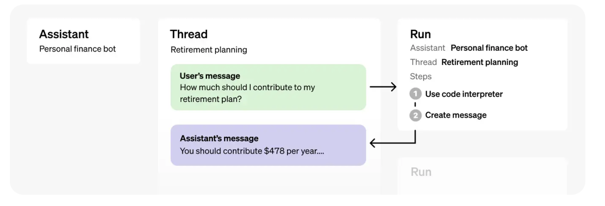

# Chris's Open AI Notes

## Text Generation

```JAVASCRIPT
import OpenAI from "openai";

const openai = new OpenAI({ apiKey: 'YOURKEYHERE' });


async function main() {
  const completion = await openai.chat.completions.create({
    messages: [{"role": "system", "content": "You are a helpful assistant with a informal funny personality."},
        {"role": "user", "content": "Who won the super bowl in 2020?"},
        {"role": "assistant", "content": "The Kansas City Chiefs won the super bowl in 2020."},
        {"role": "user", "content": "How many passing yards did Patrick Mahomes complete?"}],
    model: "gpt-3.5-turbo",
  });

  console.log(completion.choices[0]);
}

main();
```

- The main input is the `messages` parameter.
- The 'messages' parameter must be an array of objects, where each object ahs a role. 'system', 'user', or 'assistant'
- Conversations can be as short as one message or many back and forth turns.
- Typical format, 'system' message first, followed by alternating 'user' and 'assistant' messages.

- System messages, sets the behavior of the assistant. You can set the personality of the assistant or provide specific instructions about how it should behave in the conversation.
- User messages, provide requests or comments for the assistant to respond to.
- Assistant messages, sore previous assistant responses, but can also be written by you to give examples of desired behavior.

- Including conversation history is important when user instructions refer to prior messages.
- In the example above, 'How many passing yards' only makes sense in the context of the prior messages about the Super Bowl.

## Function Calling

In an API call, you can describe functions and have that model choose to output a JSON object that contains arguments to call one or many functions.

The 'Chat Completions API' does not call the function; instead, the model generates JSON that you can use to call the function in your code.

The latest models, `gpt-3.5-turbo-0125` and `gpt-4-turbo-preview`, have been trained to both detect when a function should be called and respond with JSON that adheres to the function signature more closely than previous models.

✋ Recommend building in user confirmation flows before taking actions on behalf of users (sending email, posting something online etc.)

### Common Use Cases

Function calling allows you to more reliably get structured data back from the model:

- Create assistants that answer questions by calling external APIs.
  - For example; `send_email(to: string, body: string)` or `get_current_weather(location: string, unit: 'celsius' | 'fahrenheit')`

Basics sequence for function calling:

1. Call the model with the user query and a set of functions defined in the functions parameter.
2. The model can choose to call one or more functions; the content will be a stringified JSON object.
3. Parse the string into JSON in your code and call your function with the provided arguments if they exists.
4. Call the model again by appending the function response as a new message, and le the model summarize the results back to the user.

- Not all model versions are trained with function calling. See [supported models](https://platform.openai.com/docs/guides/function-calling/supported-models).

### Parallel Function Calling

The ability to perform multiple function calls together, allowing the effects and results to be resolved in parallel.

💡 Cookbook: [How to build an agent with the OpenAI Node.js SDK](https://cookbook.openai.com/examples/how_to_build_an_agent_with_the_node_sdk)

## Guides - Prompt Engineering

Guide shows strategies for getting better results from the large language models (sometimes referred to as GPT models) like GPT-4.

- [Prompt Examples](https://platform.openai.com/examples)

### Six Strategies for getting better results

#### Write clear instructions

The models cannot read your mind. If the output are too long, ask for brief replies. If outputs are too simple, ask for expert level writing. If you dislike the format, demonstrate the format you like to see. The less teh model has to guess at what you want, the more likely you will get it.

Tactics:

- Include details in your query to get more relevant answers
- Ask the model to adopt a persona
- Use delimiters to clearly indicate distinct part of the input
- Specify the steps required to complete a task
- Provide examples
- Specify the desired length of the output

#### Provide reference text

Language models can confidently invent fake answers. IN teh same way notes can help students to better on a test, providing reference text to these models can help in answering with fewer fabrications.

Tactics:

- [Instruct the model to answer using a reference text](https://platform.openai.com/docs/guides/prompt-engineering/tactic-instruct-the-model-to-answer-using-a-reference-text)
- [Instruct the model to answer with citations from a reference text](https://platform.openai.com/docs/guides/prompt-engineering/tactic-instruct-the-model-to-answer-with-citations-from-a-reference-text)

#### Split complex tasks into simpler subtasks

Just as it's a good practice in software engineering  to decompose a complex system into a set of modular components, the same is tru of tasks submitted to a language model. Complex tasks tend to have higher error rates than simpler tasks. Complex tasks can be re-defined as a workflow fo simpler tasks in which the outputs of earlier tasks are used to construct the inputs of later tasks. .

Tactics:

- [Use intent classification to identify the most relevant instructions for a user query](https://platform.openai.com/docs/guides/prompt-engineering/tactic-instruct-the-model-to-answer-with-citations-from-a-reference-text)
- [For dialogue apps that require very long conversations, summarize or filter previous dialogue](https://platform.openai.com/docs/guides/prompt-engineering/tactic-for-dialogue-applications-that-require-very-long-conversations-summarize-or-filter-previous-dialogue)
- [Summarize long documents piecewise and construct a full summary recursively](https://platform.openai.com/docs/guides/prompt-engineering/tactic-summarize-long-documents-piecewise-and-construct-a-full-summary-recursively)

#### Give the model time to 'think'

If asked to multiple 17 by 28, you might not know it instantly, but can still work otu with some time. Similarly, models make more reasoning errors when trying to answer right away, rather than taking the time to work out an answer. Asking for a 'chain of thought' before an answer can help the model reason its way toward correct answers more reliably.

Tactics:

- [Instruct the model to work out its own solution before rushing to a conclusion](https://platform.openai.com/docs/guides/prompt-engineering/tactic-instruct-the-model-to-work-out-its-own-solution-before-rushing-to-a-conclusion)
- [Use inner monologue or a sequence of queries to hide the models reasoning process](https://platform.openai.com/docs/guides/prompt-engineering/tactic-use-inner-monologue-or-a-sequence-of-queries-to-hide-the-model-s-reasoning-process)
- [Ask the model if it missed anything on the previous passes](https://platform.openai.com/docs/guides/prompt-engineering/tactic-ask-the-model-if-it-missed-anything-on-previous-passes)

#### Use external tools

Compensate for weaknesses of the model by feeing it the outputs of other tools. For example, a text retrieval system (RAG or retrieval augmented generation) can tell the model about relevant documents. A code execution engine like OpenAI's Code Interpreter  can help the model to math and run code. If a task can be done more reliably or efficiently by a tool rather than by a LLM, offload it to get the best of both.

Tactics:

- [Use embeddings based search to implement efficient knowledge retrieval](https://platform.openai.com/docs/guides/prompt-engineering/tactic-use-embeddings-based-search-to-implement-efficient-knowledge-retrieval)
- [Use code execution to perform more accurate calculations or call external APIs](https://platform.openai.com/docs/guides/prompt-engineering/tactic-use-code-execution-to-perform-more-accurate-calculations-or-call-external-apis)
- [Give the model access to specific functions](https://platform.openai.com/docs/guides/prompt-engineering/tactic-give-the-model-access-to-specific-functions)

#### Test changes systematically

In some cases a modification to a prompt will achieve better performance on a few isolated examples but lead to worse overall performance. Test to be sure that a change in net positive to performance. Define a comprehensive test suite, known as 'eval'.

Tactics:

- [Evaluate model outputs with reference to gold-standard answers](https://platform.openai.com/docs/guides/prompt-engineering/tactic-evaluate-model-outputs-with-reference-to-gold-standard-answers)

## Assistants API

The Assistants API allow you to build AI assistants within your own apps. An Assistant ahs instructions and can leverage models, tools and knowledge to respond to user queries. The Assistants API currently supports three types of tools: Code Interpreter, Retrieval and Function calling.

Checkout the [Assistants playground](https://platform.openai.com/playground?mode=assistant)

### Overview

A typical integration of the Assistants API ahs the following flow:

1. Create an Assistant by defining its custom instruction and picking a model. Can add files, enable tools like Code Interpreter, Retrieval and Function calling.
2. Create a Thread when a user starts a conversation.
3. Add Messages to the Thread as teh user asks questions.
4. Run the Assistant on the Thread to generate a response by calling the model and the tools.

This starter guide walks through the key steps to create adn run an Assistant that uses Code Interpreter. In this example, we are creating an Assistant that is a personal math tutor, with the Code Interpreter tool enabled.

Step 1: Create an Assistant

An [Assistant](https://platform.openai.com/docs/api-reference/assistants/object) represents an entity that can be configured to respond to a user's messages using several parameters like `model`, `instructions`, and `tools`.

```JAVASCRIPT
import OpenAI from "openai";
const openai = new OpenAI();
 
async function main() { 
  const assistant = await openai.beta.assistants.create({
    name: "Math Tutor",
    instructions: "You are a personal math tutor. Write and run code to answer math questions.",
    tools: [{ type: "code_interpreter" }],
    model: "gpt-4-turbo-preview"
  });
}
 
main();
```

Step 2: Create a Thread

A Thead represents a conversation between a user and one or many Assistants. you can create a Thread when a user (Or your AI App) starts a conversation with your Assistant.

```JAVASCRIPT
const thread = await openai.beta.threads.create();
```

Step 3: Add a Message to the Thread

The contents of the messages your users or applications create are added as Message objects to the Thread. Messages can contain both text and files. There is no limit to the number of Messages you can add to Threads - we can truncate any context that does not fit into the model's context window.

```JAVASCRIPT
const message = await openai.beta.threads.messages.create(
  thread.id,
  {
    role: "user",
    content: "I need to solve the equation `3x + 11 = 14`. Can you help me?"
  }
);
```

Step 4: Create a Run

Once all the user Messages have been added to the Thread, you can Run the Tread with any Assistant. **Creating a Run uses the model and tools associated with the Assistant to generate a response.** These responses are added to the Thread as `assistant` Messages.

- Without Streaming:

```JAVASCRIPT
let run = await openai.beta.threads.runs.createAndPoll(
  thread.id,
  { 
    assistant_id: assistant.id,
    instructions: "Please address the user as Jane Doe. The user has a premium account."
  }
);
```

Once the Run completes, you can list the Messages added to the Thread by the Assistant.

```JAVASCRIPT
if (run.status === 'completed') {
  const messages = await openai.beta.threads.messages.list(
    run.thread_id
  );
  for (const message of messages.data.reverse()) {
    console.log(`${message.role} > ${message.content[0].text.value}`);
  }
} else {
  console.log(run.status);
}
```

All together, run this in your terminal:

```JAVASCRIPT
import OpenAI from "openai";
const openai = new OpenAI('YOURKEYHERE');
// Assistant API
async function main() { 
  const assistant = await openai.beta.assistants.create({
    name: "Math Tutor",
    instructions: "You are a personal math tutor. Write and run code to answer math questions.",
    tools: [{ type: "code_interpreter" }],
    model: "gpt-4-turbo-preview"
  });

  const thread = await openai.beta.threads.create();

  const message = await openai.beta.threads.messages.create(
  thread.id,
  {
    role: "user",
    content: "I need to solve the equation `3x + 11 = 14`. Can you help me?"
  }
);

let run = await openai.beta.threads.runs.createAndPoll(
  thread.id,
  { 
    assistant_id: assistant.id,
    instructions: "Please address the user as Jane Doe. The user has a premium account."
  }
);

if (run.status === 'completed') {
  const messages = await openai.beta.threads.messages.list(
    run.thread_id
  );
  for (const message of messages.data.reverse()) {
    console.log(`${message.role} > ${message.content[0].text.value}`);
  }
} else {
  console.log(run.status);
}

}
 
main();
```

- [How Assistants Work](https://platform.openai.com/docs/assistants/how-it-works/agents)

### How Assistants Work

Designed to help developers build powerful AI assistants capable of performing a variety of tasks.

1. Assistants can call Open AI's models with specific instructions to tune their personality and capabilities.
2. Assistants can access multiple tools in parallel. These an be both OpenAI hosted tools, like Code interpreter and knowledge retrieval - or tools you build and host via function calling
3. Assistants can access persistent Threads. Threads simplify AI application development by storing message history and truncating it when the convertion get too long fo rthe model's context length. You can create a Thread once and simply append Messages to it as your users reply.
4. Assistants can access Files in several formats - eithe ras part of their creation or as part of Threads between Assistants and users. When using tools, Assistants can also create files (images, spreadsheets) and cite files they reference int he Messages they create.

#### Objects



- Assistant - Purpose built AI that uses OpenAi's models and calls tools
- Thread - A conversation session between an Assistant and a user. Threads store Messages and automatically handle truncation to fit content into a model's context.
- Message - A message created by an Assistant or a user. Messages can include text, images, and other files. Messages stored as a list on the Thread.
- Run - An invocation of an Assistant on a Thread. The Assistant uses its configuration and the Thread's Messages to perform tasks by calling models and tools. As part of a Run, teh Assistant appends Messages to the Thread.
- Run Step - A detailed list of steps the Assistant took as part of a Run. And Assistant can call tools or create Messages during tis run. Examining the Run Steps allow you to introspect how the Assistant is getting to its final results.

#### Creating Assistants

ℹ️ Recommend using the latest models with the Assistants API for best results and maximum compatibility with tools.

To get started, creating an Assistant only requires specifying the `model` to use. But you can futher customize the behavior fo the Assistant:

1. Use the `instructions` parameter to guide the personality of the Assistant and define its goals. Instructions are similar to system messages in the Chat Completions API.
2. Use the `tools` parameter to give teh Assistant access up to 128 tools. You can give it access to OpenAI-hosted tools like `code_interpreter` and `retrieval` or call a third party tools via `function` calling.
3. Use the `file_ids` parameter to give teh tools like `code-Interpreter` and `retrieval` access to files. Files are uploaded using the `File` upload endpoint and must have the `purpose` set to `assistants` to be used with this API.

For example, to create an Assistant that can create data visualization based on a `.csv` file, first upload a file.

```JAVASCRIPT
const file = await openai.files.create({
  file: fs.createReadStream("mydata.csv"),
  purpose: "assistants",
});
```

- And then create the Assistant with the uploaded file.

```JAVASCRIPT
const assistant = await openai.beta.assistants.create({
  name: "Data visualizer",
  description: "You are great at creating beautiful data visualizations. You analyze data present in .csv files, understand trends, and come up with data visualizations relevant to those trends. You also share a brief text summary of the trends observed.",
  model: "gpt-4-turbo",
  tools: [{"type": "code_interpreter"}],
  file_ids: [file.id]
});
```

- You can attach a maximum of 20 files per Assistant, and they can be at most 512 MD each.
- The size of all the files uploaded by your organization should not exceed 10 GB.
- In addition to the 512 MB file size, each file can only contain 2,000,000 tokens.
- Assistant or Message creation will fail if any attached files exceed the token limit.

- You can also use the `AssistantFile` object to create, delete, or view associations between Assistant and File objects.
- Note that deleting an `AssistantFile` doesn't delete the original File object, if simply deletes the association between that File and teh Assistant. T
- To delete a File, use the File `delete` endpoint instead.

#### Managing Threads and Messages

- Threads and Messages represent a conversation session between an Assistant and a user.
- There is no limit to the number of Messages you can store in a Thread.
- Once the size fo the Messages exceeds the context window fo the model, the Tread will attempt to include as many messages as possible that fit in the context window and drop the oldest messages.
- You can create a Thread with an initial list of Messages like this:

```JAVASCRIPT
const thread = await openai.beta.threads.create({
  messages: [
    {
      "role": "user",
      "content": "Create 3 data visualizations based on the trends in this file.",
      "file_ids": [file.id]
    }
  ]
});
```

- Messages can contain text, images or files.
- At the moment, user-created Messages cannot contain image files but we plan to add support for this in the future.
- Messages also have the same file size and token limits as Assistants (512MB file size and a 2 million token limit).

#### Context window management

The Assistants API can automatically manage teh context window such that you never exceed the models context length, however, we have exposed some controls to allow you some flexibility in managing the context window.

##### Max Completion and Max Prompt Tokens

- To limit the amount of tokens the model is allowed to consume during a single run, you may set `max_prompt_tokens` and `max_completion_tokens` when creating a run.
- During the run, an additional completion would cuase the run to exceed these values, we will end the run with a status `complete`.
- More details may be found in the `incomplete_details` field of the run object.

- These values control the context size and `max_tokens` values used during completion.
- Values get 'spend down' over the course of the run, which could be composed of multiple completions.

- For example, you create a run with `max_prompt_tokens` set to 500 and `max_completion_tokens` set to 1000.
- On teh first completion, open ai will truncate your thread to 500 tokens according to your truncation strategy, and set the `max_tokens` fo the completion to 1000.
- On those settings, say you used 200 prompt tokens and 300 completion tokens. On teh second generation, we will use up the 300 tokens for the prompt and 700 tokens for the completion.

##### Truncation Strategy
