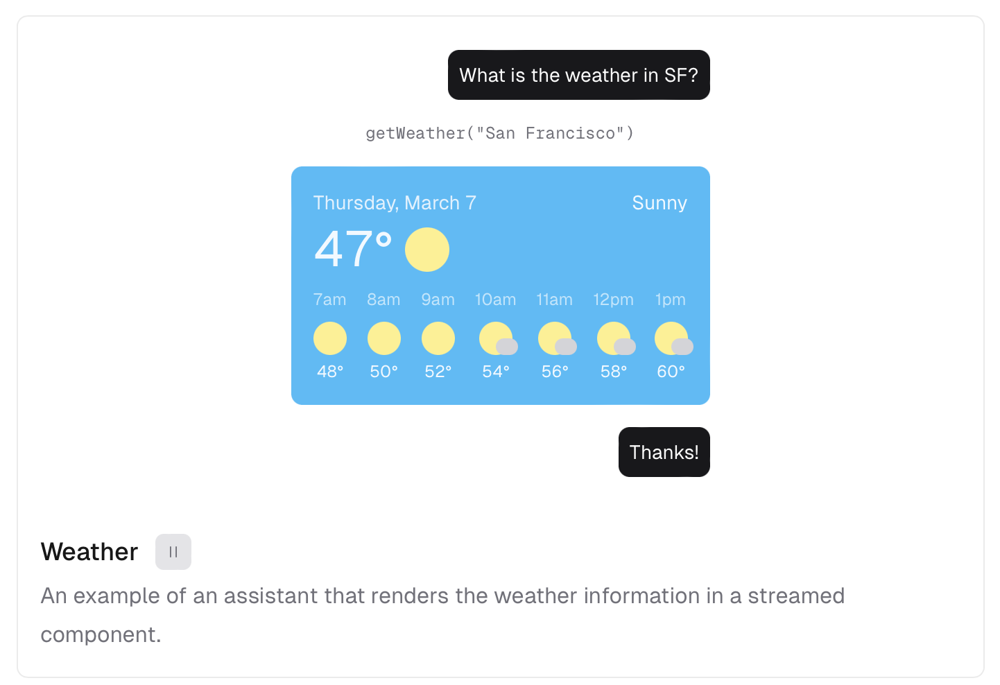
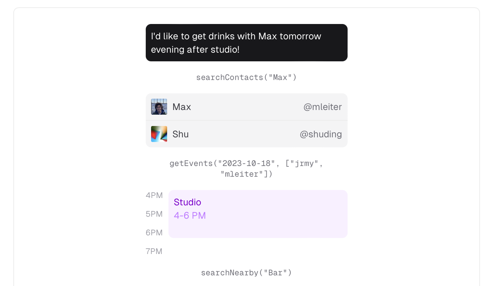

# Vercel SDK Notes

## AI SDK React Server Components (RSC)

React Server Components gives you the ability to write UI that can be rendered on the server and streamed to the client. This way, language model generations and UI updates can be done form the server, making it easier to work with them in teh same place and keep them in sync.

Can go beyond just rendering text by rendering React components as part of their generations, how they can get increasingly difficult to build when they are rendered on the client as your app grows, and how RSC can help you stream them form the server instead.

### Rendering User Interfaces with Language Models

Language models generate text so at first, may seem like you would only need to render text in your application.

```JAVASCRIPT
// app/actions.tsx
const text = generateText({
  model: openai('gpt-3.5-turbo'),
  system: 'you are a friendly assistant'
  prompt: 'what is the weather in SF?'
  tools: {
    getWeather: {
      description: 'Get the weather for a location',
      parameters: z.object({
        city: z.string().describe('The city to get the weather for'),
        unit: z
          .enum(['C', 'F'])
          .describe('The unit to display the temperature in')
      }),
      execute: async ({ city, unit }) => {
        const weather = getWeather({ city, unit })
        // return the text
        return `It is currently ${weather.value}°${unit} and ${weather.description} in ${city}!`
      }
    }
  }
})
```

In the above example, the language model calls the `getWeather` function and returns the weather information as text.
💡 However, if you return a JSON object that represents the weather information, you can use it to render a React Component instead.

```JAVASCRIPT
// app/actions.ts
const text = generateText({
  model: openai('gpt-3.5-turbo'),
  system: 'you are a friendly assistant'
  prompt: 'what is the weather in SF?'
  tools: {
    getWeather: {
      description: 'Get the weather for a location',
      parameters: z.object({
        city: z.string().describe('The city to get the weather for'),
        unit: z
          .enum(['C', 'F'])
          .describe('The unit to display the temperature in')
      }),
      execute: async ({ city, unit }) => {
        const weather = getWeather({ city, unit })
        const { temperature, unit, description, forecast } = weather
        // return weather information as JSON
        return {
          temperature,
          unit,
          description,
          forecast
        }
      }
    }
  }
})
```

Now you can use the object returned by the `getWeather` function to conditionally render a React component `<WeatherCard />` that displays the weather information by **passing the object as props**.

```JAVASCRIPT
// app/page.tsx
return (
  <div>
    {messages.map(message => {
      if (message.role === 'function') {
        const { name, content } = message
        const { temperature, unit, description, forecast } = content;

        return (
          <WeatherCard
            weather={{
              temperature: 47,
              unit: 'F',
              description: 'sunny'
              forecast,
            }}
          />
        )
      }
    })}
  </div>
)
```

A preview of what that can look like.



Rendering interfaces as part of the language model can help you elevate the UX, go beyond just text.

### Rendering Multiple User Interfaces

To recap, an application has to go through the following steps to render user interfaces as part of model generations:

1. The user sends a message to the language model.
2. The language model generates a response that includes a function call.
3. The function call returns a JSON object that represents the user interface.
4. The response is sent to the client.
5. The client receives the response and checks if the latest message was a function call.
6. If it was a function call, the client renders the user interface based on the JSON object returned by the function call.

Most applications have multiple functions that are called by the language model, and each function can return a different user interface.

For example, a function that searches for courses can return a list of courses, while a function that searches for people can return a list of people.

As the list grows, the complexity of your application will grow as well and it can become increasingly difficult to manage these user interfaces.

```JAVASCRIPT
{
  message.role === 'function' ? (
    message.name === 'api-search-course' ? (
      <Courses courses={message.content} />
    ) : message.name === 'api-search-profile' ? (
      <People people={message.content} />
    ) : message.name === 'api-meetings' ? (
      <Meetings meetings={message.content} />
    ) : message.name === 'api-search-building' ? (
      <Buildings buildings={message.content} />
    ) : message.name === 'api-events' ? (
      <Events events={message.content} />
    ) : message.name === 'api-meals' ? (
      <Meals meals={message.content} />
    ) : null
  ) : (
    <div>{message.content}</div>
  );
}
```

### Rendering User Interfaces on the Server

In order ot solve the problem of managing all your React components on teh client side, React Server Components (RSC) allow you to render React components ont eh server and stream teh to the client.

This prevents you from conditionally rendering user interfaces on the client based on the data returned by the language model, and instead allows you to directly stream them from the server during a model generation.

```JAVASCRIPT
import { createStreamableUI } from 'ai/rsc'

// CREATE STREAM TO SEND TO CLIENT
const uiStream = createStreamableUI();

const text = generateText({
  model: openai('gpt-3.5-turbo'),
  system: 'you are a friendly assistant'
  prompt: 'what is the weather in SF?'
  tools: {
    getWeather: {
      description: 'Get the weather for a location',
      parameters: z.object({
        city: z.string().describe('The city to get the weather for'),
        unit: z
          .enum(['C', 'F'])
          .describe('The unit to display the temperature in')
      }),
      execute: async ({ city, unit }) => {
        const weather = getWeather({ city, unit })
        const { temperature, unit, description, forecast } = weather

        // RENDER THE COMPONENT ON THE SERVER WITH PROPS PASSED TO IT
        uiStream.done(
          <WeatherCard
            weather={{
              temperature: 47,
              unit: 'F',
              description: 'sunny'
              forecast,
            }}
          />
        )
      }
    }
  }
})

return {
  display: uiStream.value
}
```

The `createStreamableUI` function belongs to the `ai/rec` module and helps you create a stream that can send React components to the client.

So on teh server, you are directly rendering the `<WeatherCard/>` component with the props passed to it, and then streaming it to the client 📣 🫢. As a results, on the client side, you only need to render the UI that is streamed from the server.

```JAVASCRIPT
return (
  <div>
    {messages.map(message => (
      <div>{message.display}</div>
    ))}
  </div>
);
```

Now the steps involved are simplified as:

1. Teh user sends a message to the language model.
2. The language model generates a response that includes a function call.
3. The function call renders a React Component along with teh relevant props that represent the user interface.
4. The response is streamed to the client and rendered directly.

ℹ️ Note: You can also render text on the server and stream it to the client using RSC.

In the next sections, learn about the `ai/rsc` module provides you with tools to integrate generative UI in your apps.

## Streaming User Interfaces

The RSC API allow you to stream user interfaces from the server to the client using `createStreamableUI`

📣 This is useful when you want to go beyond raw data and stream React components to the client in real time.

### Creating a Streamable UI

You can import `createStreamableUI` from `ai/rsc` and use it to create a streamable UI.

```JAVASCRIPT
'use server'

import { createStreamableUI } from 'ai/rsc'

export async function getWeather {
  const weatherUI = createStreamableUI()

  weatherUI.update(<div style={{ color: 'gray' }}>Loading...</div>)

  setTimeout(() => {
    weatherUI.done(<div>It's a sunny day!</div>)
  }, 1000)

  return weatherUI.value
}
```

In the example above, `use server` is used to indicate that the exported function is a Server Action function that can be requested by the client. INitially, we create a streamable UI and update it with a loading message. Adn the `.value` property contains the actual UI piece that can be sent to the client.

### Reading a Streamable UI

On the client side, you can request to the `getWeather` Server Action via a normal function call, render the returned UI like any other normal React components.

```JAVASCRIPT
import { useState } from 'react';
import { readStreamableValue } from 'ai/rsc';
import { runThread } from '@/actions';

export default function Page() {
  const [weather, setWeather] = useState(null);

  return (
    <div>
      <button
        onClick={async () => {
          const weatherUI = await getWeather();
          setWeather(weatherUI);
        }}
      >
        What's the weather?
      </button>

      {weather}
    </div>
  );
}
```

When the button is clicked, the `getWeather` function is called, and the returned UI is set to the `weather` state and rendered on the page. Users wil see the loading message first and then the actual weather information after 1 second.

You can also handle multiple streams in a single request.

## Streaming Values

The RSC API allows you to stream serializable JS values form the server to the client using `createStreamableValue`, such as strings, numbers, objects and arrays.

This is useful when you want to stream:

- Text generations from the language in real-time
- Buffer values of image and audio generations from multi-modal models
- Progress updates form multi-step agent runs

### Creating a Streamable Value

You can import `createStreamableValue` from `ai/rsc` and use it to create a streamable value.

```JAVASCRIPT
'use server';

import { createStreamableValue } from 'ai/rsc';

export const runThread = async () => {
  const streamableStatus = createStreamableValue('thread.init');

  setTimeout(() => {
    streamableValue.update('thread.run.create');
    streamableValue.update('thread.run.update');
    streamableValue.update('thread.run.end');
    streamableValue.done('thread.end');
  }, 1000);

  return {
    status: streamableStatus.value,
  };
};
```

### Reading a Streamable Value

You can read a streamable value on teh client using `readStreamableValue`. It returns an async iterator that yields the value of the streamable as it is updated:

```JAVASCRIPT
import { readStreamableValue } from 'ai/rsc';
import { runThread } from '@/actions';

export default function Page() {
  return (
    <button
      onClick={async () => {
        const { status } = await runThread();

        for await (const value of readStreamableValue(status)) {
          console.log(value);
        }
      }}
    >
      Ask
    </button>
  );
}
```

## Generative User Interfaces

Since language models can render user interfaces as part of their generations, the resulting model generations are referred to as generative user interfaces.

### Deterministic Routes and Probabilistic Routing

The first implication of user interfaces being generative is that they are not deterministic in nature. They depend on the generation output by the model. This is because they depend on the generation output by the model.

Since these generation are 'probabilistic' (variation), it is possible for every user query to result in a different user interface being generated.

Users expect their experience using your application to be predictable, so non-deterministic user interfaces can sound like a bad idea at first.

However, one way language models can be set up to limit their generations to a particular set of outputs is to use their ability to call functions.

When language models are provided with a set of function definitions, and instructed that it can choose to execute any of them based on the user query, it does one of the following two things:

- Execute a function that is more relevant to the user query.
- Not execute any function if the user query is otu of bounds the set of functions available to them.

```JAVASCRIPT
const sendMessage = (prompt: string) => generateText({
  model: 'gpt-3.5-turbo'
  system: "you are a friendly weather assistant!",
  prompt,
  tools: {
    getWeather: {
      description: 'Get the weather in a location',
      parameters: z.object({
        location: z.string().describe('The location to get the weather for')
      }),
      execute: async ({ location }: { location: string }) => ({
        location,
        temperature: 72 + Math.floor(Math.random() * 21) - 10
      })
    },
  }
})

sendMessage('What is the weather in San Francisco?') // getWeather is called
sendMessage('What is the weather in New York?')      // getWeather is called
sendMessage('What events are happening in London?')  // No function is called
```

- This way, it is possible to ensure that the generations result in deterministic outputs, while the choice a model makes still remains to be probabilistic.

- This emergent ability by a language model to choose whether a function needs to be executed or not based on a user query is believed to be models emulating 'reasoning'.

- 📣 As a result, the combination of language models being able to reason which function to execute as well as render UI at the same time gives you the ability to build applications where **language models can be used as a router**. 📣

### Language Models as Routers

Historically, developers had to write routing logic that connected different parts of an application to be navigable by a user and complete a specific task.

In web apps today, most of the routing logic takes place in the form of routes:

- `/login` would navigate you to a page with a login form.
- `/user/john` would navigate you to a page with profile details about John.
- `/api/events?limit=5` would display the five most recent events from an events database.

While routes help you build web applications that connect different pars of an application into a seamless user experience, it can also be a burden to manage them as the complexity of applications grow.

Next.js ahs helped reduce the complexity in developing with routes by introducing:

- File based routing system
- Dynamic routing
- API routes
- Middleware
- App router and so on...

📣 With language models becoming better at reasoning, we believe that there is a future where developers only write core application specific components while models take care of routing them based on the user's state in an application. 📣

With generative user interfaces, the language model decides which user interface to render based on the user's stat in the application, **giving users the flexibility to interact with your application in a conversational manner instead of navigating through a series of predefined routes.**

### Routing by parameters

For routes like:

- `/profile/[username]`
- `/search?q=[query]`
- `/media/[id]`

that has segments that are dependent on dynamic data, the language model can generate the correct parameters and render the user interface.

For example, when you are in a search application, you can ask the language model to search for artworks from different artists. The language model will call teh search function with the artist's name as a parameter and render the search results.

### Routing by sequence

🫢 For actions that require a sequence of steps to be completed by navigating through different routes, the language model can generate the correct sequence of routes to complete in order to fulfill teh user's request.

For example, when you are in a calendar application, you can ask teh LLM to schedule a happy hour evening with your friends. The LLM will then understand your request and will perform the right sequence of **function** calls to:

1. Look up your calendar, `searchContacts('max')`
2. Look up your friends calendars, `getEvents()`
3. Determine the best time for everyone
4. Search for nearby happy hour spots, `searchNearby('Bar')`
5. Create an event and send out invites to your friends



📣 The LLM calls functions and generates interfaces based on user intent, acting like a router.

Just by defining functions to lookup contacts, pull events from a calendar, and search for nearby locations, the model is able to sequentially navigate the routs for you.

## What is AI and UI State?

There is a recurring pattern of having a state for the LLM on the server, and a state for teh UI on the client. However, it can get tricky to manage these two states separately and keep them in sync.

For example, in a chat application, the **AI state is usually the conversation history** (messages) between the user and the assistant.

The LLM reads this history so it can generate the next message. this value is also the source of truth for the current application state. On the client side, the **UI state** is the list of actual UI elements that are displayed to the user.

In traditional text-based chat applications, teh displayed UI elements are just plain text. They are identical to the conversation history passed to the AI.

However, with Generative UI, what gets presented to the user can be more complex, dynamic and hybrid that just plain text. This is where teh **AI and UI state can diverge**.

The RSC API give you teh flexibility to manage these two states separately, while providing a way to keep them in sync between your database, server and client.

### AI State

It contains the context the LM needs to read. For a chat app, the AI state is generally the conversation history between the user and the assistant. In practice, it can also be used to store other values and meta information such as `createdAt` for each message and `chatId` for each conversation. the AI state, can be accessed/ modified from both the server and the client.

### UI State

It contains the generated UI and other information for the client-side of the application, that is displayed to the user. It is a fully client-side state (similar to `useState`) that can store anything from JS values to React elements. It CANNOT be accessed from the server-side.

### Creating the AI Context

To start, you need to create an React context using `createAI`, and wrap your application with it. Then, the AI and UI states will be available to all its children.

```JAVASCRIPT
// Define the AI state and UI state types
export type AIState = Array<{
  role: 'user' | 'assistant';
  content: string;
}>;

export type UIState = Array<{
  id: string;
  role: 'user' | 'assistant';
  display: ReactNode;
}>;

async function sendMessage(message: string) {
  'use server';

  // Handle the message, covered in the following sections.
}

// Create the AI provider with the initial states and allowed actions
export const AI = createAI({
  initialAIState: [] as AIState,
  initialUIState: [] as UIState,
  actions: {
    sendMessage,
  },
});
```

### Using the AI Context

The AI context can be used in any Server Component, to wrap the children components that need access to the AI. For example, you can wrap your root layout component with it.

```JAVASCRIPT
import { type ReactNode } from 'react';
import { AI } from './actions';

export default function RootLayout({
  children,
}: Readonly<{ children: ReactNode }>) {
  return (
    <AI>
      <html lang="en">
        <body>{children}</body>
      </html>
    </AI>
  );
}
```

### Reading UI State in Client

The UI state can be accessed in Client Components using the `useUIState` hook provided by the RSC API. The hook returns the current UI state and a function to update the UI state like React's `useState`.

```JAVASCRIPT
'use client';

import { useUIState } from 'ai/rsc';

export default function Page() {
  const [messages, setMessages] = useUIState();

  return (
    <ul>
      {messages.map(message => (
        <li key={message.id}>{message.display}</li>
      ))}
    </ul>
  );
}
```

### Reading AI State in Client

The AI state can be accessed in Client Components using the `useAIState` hook provided by the RSC API. This hook returns the current AI state.

```JAVASCRIPT
'use client';

import { useAIState } from 'ai/rsc';

export default function Page() {
  const [messages, setMessages] = useAIState();

  return (
    <ul>
      {messages.map(message => (
        <li key={message.id}>{message.content}</li>
      ))}
    </ul>
  );
}
```

### Reading AI State on Server

The AI State can be accessed by the Server Action we provided to `createAI`, using the `getAIState` function. It returns teh current AI state as a read-only value:

```JAVASCRIPT
import { getAIState } from 'ai/rsc';

export async function sendMessage(message: string) {
  'use server';

  const history = getAIState();

  const response = await generateText({
    model: openai('gpt-3.5-turbo'),
    messages: [...history, { role: 'user', content: message }],
  });

  return response;
}
```

### Updating AI State on Server

The AI State can also be updated by the Server Action with the `getMutableAIState` function. Similar to `getAIState`, but it returns the state with methods to read and update it:

```JAVASCRIPT
import { getMutableAIState } from 'ai/rsc';

export async function sendMessage(message: string) {
  'use server';

  const history = getMutableAIState();

  // Update the AI state with the new user message.
  history.update([...history.get(), { role: 'user', content: message }]);

  const response = await generateText({
    model: openai('gpt-3.5-turbo'),
    messages: history.get(),
  });

  // Update the AI state again with the response from the model.
  history.done([...history.get(), { role: 'assistant', content: response }]);

  return response;
}
```

### Calling Server Actions from Client

To call the `sendMessage` action from the client, you can use the `useActions` hook. The hook returns all the available Actions that were provided to `createAI`.

```JAVASCRIPT
'use client';

import { useActions, useUIState } from 'ai/rsc';

export default function Page() {
  const { sendMessage } = useActions();
  const [messages, setMessages] = useUIState();

  const handleSubmit = async event => {
    event.preventDefault();

    setMessages([
      ...messages,
      { id: Date.now(), role: 'user', display: event.target.message.value },
    ]);

    const response = await sendMessage(event.target.message.value);
    setMessages([
      ...messages,
      { id: Date.now(), role: 'assistant', display: response },
    ]);
  };

  return (
    <>
      <ul>
        {messages.map(message => (
          <li key={message.id}>{message.display}</li>
        ))}
      </ul>
      <form onSubmit={handleSubmit}>
        <input type="text" name="message" />
        <button type="submit">Send</button>
      </form>
    </>
  );
}
```

When the user submits a message, the `sendMessage` action is called with the message content. The response from the action is then added to the UI state, updating the displayed messages.

## Saving and Restoring States

The RSC API provides a convenient methods for saving and restoring the state of your AI and UI state. This is useful for saving the state of your application after every model generation, and restoring it when the user revisits the generations.

### AI State

#### Saving AI state

The AI state can be saved using the `onSetAIState` callback, which gets called whenever the AI state is updated. In the following example, we save the chat history to a database, whenever the generation is marked as done.

```JAVASCRIPT
export const AI = createAI<ServerMessage[], ClientMessage[]>({
  actions: {
    continueConversation,
  },
  onSetAIState: async ({ state, done }) => {
    'use server';

    if (done) {
      saveChatToDB(state);
    }
  },
});
```

#### Restoring AI state

The AI state can be restored using the `initialAIState` prop passed to the context provider created by the `createAI` function. In the example, we restore the chat history from a database when the component is mounted.

```JAVASCRIPT
import { ReactNode } from 'react';
import { AI } from './actions';

export default async function RootLayout({
  children,
}: Readonly<{ children: ReactNode }>) {
  const chat = await loadChatFromDB();

  return (
    <html lang="en">
      <body>
        <AI initialAIState={chat}>{children}</AI>
      </body>
    </html>
  );
}
```

### UI State

#### Saving UI State

The UI state cannot be saved directly, since the contents are not yet serializable. Instead,  you cna use the AI state as a proxy to store details about the UI state and use it to restore teh UI sate when needed. you can check out the Restoring UI State sectoin for more details.

#### Restoring UI state

The UI state can be restored using the AI state as a proxy. In the following example, we restore the chat history form the AI state when teh component is mounted. We will use `onGetUIState` callback to listen for SSR events and restore the UI state.

```JAVASCRIPT
export const AI = createAI<ServerMessage[], ClientMessage[]>({
  actions: {
    continueConversation,
  },
  onGetUIState: async () => {
    'use server';

    const historyFromDB: ServerMessage[] = await loadChatFromDB();
    const historyFromApp: ServerMessage[] = getAIState();

    // If the history from the database is different from the
    // history in the app, they're not in sync so return the UIState
    // based on the history from the database

    if (historyFromDB.length !== historyFromApp.length) {
      return history.map(({ role, content }) => ({
        id: nanoid(),
        role,
        display:
          role === 'function' ? (
            <Component {...JSON.parse(content)} />
          ) : (
            content
          ),
      }));
    }
  },
});
```

### Designing Multi-step Interfaces

📣 Multi-step interfaces refer to user interfaces that require multiple independent steps to be completed in order to achieve a specific task.

In order to understand multi-step interfaces, it is important to understand two concepts:

- Function composition
- Application context

**Function composition** is the process of combining multiple function to create a new function. This is a powerful concept that allows you to break down complex tasks into smaller, more manageable steps.

**Application context** refers to the state of the application at any given point in time. This includes the user's input, the output of the language model, and any other relevant information.

When designing multi-step interfaces, you ned to consider how the functions in your application can be composed together to form a coherent UX as well as how the application context changes as the user progresses through the interface.

### Application Context

The application context can be thought of as the conversation history between the user and the model. The richer the context, the more information the modal has to generate relevant responses.

In the context of multistep interfaces, the application context becomes even more important. This is because the user's input in one step may affect the output of the model in the next step.

For example, consider a meal logging app that helps users track their daily food intake. Thelanguage model is provided with the following functions:

- `log_meal` takes in parameters like the name of the food, the quantity, and the time of consumption to log a meal.
- `delete_meal` takes in the name of the meal to be deleted.

When the user logs a meal, the model generates a response confirming the meal has been logged.

```JAVASCRIPT
User: Log a chicken shawarma for lunch.
Function: log_meal("chicken shawarma", "250g", "12:00 PM")
Model: Chicken shawarma has been logged for lunch.
```

Now when the user decides to delete the meal, the model should be able to reference the previous step to identify the meal to be deleted.

```JAVASCRIPT
User: Log a chicken shawarma for lunch.
Function: log_meal("chicken shawarma", "250g", "12:00 PM")
Model: Chicken shawarma has been logged for lunch.
...
...
User: I skipped lunch today, can you update my log?
Function: delete_meal("chicken shawarma")
Model: Chicken shawarma has been deleted from your log.
```

In this example, managing the application context is important for the model to generate the correct response. Teh model needs to have information about the previous actions in order for it to use generate the parameters for teh `delete_meal` function.

### Function Composition

📣 Function composition is the process of combining multiple functions to create a new function.

This involves defining the inputs and outputs of each function, as well as how they interact with each other.

🫢 The design of how these function can be composed together to form a multi-step interface is crucial to both the UX of your application and the model's ability go generate the correct output.

For example, consider a flight booking assistant that can help users book flights. The assistant can be designed to have the following functions:

- `searchFlights`: Searches for flights based on the user's query.
- `lookupFLight`: Looks up details of a specific flight based on the flight number.
- `bookFlight`: Books a flight based on the user's selection.

The `searchFlights` function is called when the user wants to lookup flights for a specific route. This would typically mean teh function should be able to take in parameters like the origin and destination of the flight.

The `lookupFlight` function is called when the user wants to get more details about a specific flight. This would typically mean the function should be able to take in parameters like the flight number and return information about search avail.

The `bookFlight` function is called when the user decides to book a flight. In order to identify the flight to book, the function should be able to take in parameters like the flight number, trip date and passenger details.

So the conversation between the user and the model could look like this:

```JAVASCRIPT
User: I want to book a flight from New York to London.
Function: searchFlights("New York", "London")
Model: Here are the available flights from New York to London.
User: I want to book flight number BA123 on 12th December for myself and my wife.
Function: lookupFlight("BA123") -> "4 seats available"
Model: Sure, there are seats available! can you provide the names of the passengers?
User: John Doe and Jane Doe.
Function: bookFlight("BA123", "12th December", ["John Doe", "Jane Doe"])
Model: Your flight has been booked!
```

The `lookupContacts` function is called before the `bookFlight` funciton to ensure that the passenger details are available in the application context when booking the flight. This way, the model can reduce the number of steps required from the user and use its ability to call functions that populate its context and use that information to complete the booking process.

Now, let's introduce another function called `lookupBooking` that can be used to show booking details by taking in the name of the passenger as parameter. This function can be composed with the existing functions to provide a more complete user experience.

```JAVASCRIPT
User: What's the status of my wife's upcoming flight?
Function: lookupContacts() -> ["John Doe", "Jane Doe"]
Function: lookupBooking("Jane Doe") -> "BA123 confirmed"
Function: lookupFlight("BA123") -> "Flight BA123 is scheduled to depart on 12th December."
Model: Your wife's flight BA123 is confirmed and scheduled to depart on 12th December.
```

In this example, the `lookupBooking` function is used to provide teh user with the status of their wife's upcoming flight. By composing this function with the existing functions, the model is able to generate a response that includes the booking status and the departure data of the flight without requiring the user ot provide additional information.

As a result the more functions you design that can be composed together, the more complex and powerful  your apps can become. 📣

## Error Handling

Two categories of errors can occur when working with the RSC API: errors while streaming user interfaces and erros while streaming other values.

### Handling UI Errors

To handle errors while generating UI, the `streamableUI` object exposes an `error()` method.

```JAVASCRIPT
'use server';

import { createStreamableUI } from 'ai/rsc';

export async function getStreamedUI() {
  const ui = createStreamableUI();

  (async () => {
    ui.update(<div>loading</div>);
    try {
      const data = await fetchData();
      ui.done(<div>{data}</div>);
    } catch (e) {
      ui.error(<div>Error: {e.message}</div>);
    }
  })();

  return ui.value;
}
```

With this method, you can catch any error with the stream, and return relevant UI. On the client, you can also use a React Error Boundary to wrap the streamed component and catch any additional errors.

```JAVASCRIPT
import { getStreamedUI } from '@/actions';
import { useState } from 'react';
import { ErrorBoundary } from './ErrorBoundary';

export default function Page() {
  const [streamedUI, setStreamedUI] = useState(null);

  return (
    <div>
      <button
        onClick={async () => {
          const newUI = await getStreamedUI();
          setStreamedUI(newUI);
        }}
      >
        What does the new UI look like?
      </button>
      <ErrorBoundary>{streamedUI}</ErrorBoundary>
    </div>
  );
}
```

### Handling Other Errors

To handle other errors while streaming, you can return an error object that the receiver can use to determine why the failure occurred.

```JAVASCRIPT
'use server';

import { createStreamableValue } from 'ai/rsc';
import { fetchData, emptyData } from '../utils/data';

export const getStreamedData = async () => {
  const streamableData = createStreamableValue<string>(emptyData);

  try {
    (() => {
      const data1 = await fetchData();
      streamableData.update(data1);

      const data2 = await fetchData();
      streamableData.update(data2);

      const data3 = await fetchData();
      streamableData.done(data3);
    })();

    return { data: streamableData.value };
  } catch (e) {
    return { error: e.message };
  }
};
```

## Authentication

The RSC API makes extensive use of Server Actions to power streaming values and UI from the server.

Sever Actions are exposed as public, unprotected endpoints. As a result you should treat Server Actions as you would public-facing API endpoints that the user is authorized to perform the action before returning any data.

```JAVASCRIPT
'use server';

import { cookies } from 'next/headers';
import { createStremableUI } from 'ai/rsc';
import { validateToken } from '../utils/auth';

export const getWeather = async () => {
  const token = cookies().get('token');

  if (!token || !validateToken(token)) {
    return {
      error: 'This action requires authentication',
    };
  }
  const streamableDisplay = createStreamableUI(null);

  streamableDisplay.update(<Skeleton />);
  streamableDisplay.done(<Weather />);

  return {
    display: streamableDisplay.value,
  };
};
```

## Examples, Generate Text

When you need to generate text based on a prompt. For example you may want to generate a response to a question or summarize a body of text. The `generateText` function can be used to generate text based on the input prompt.

### Client

Let's create a simple React component that will call the `getAnswer` function when a button is clicked. The `getAnswer` function wil call the `generateText` function from the `ai` module, which wil then generate text based on the input prompt.

```JAVASCRIPT
'use client';

import { useState } from 'react';
import { getAnswer } from './actions';

export default function Home() {
  const [generation, setGeneration] = useState<string>('');

  return (
    <div>
      <button
        onClick={async () => {
          const { text } = await getAnswer('Why is the sky blue?');
          setGeneration(text);
        }}
      >
        Answer
      </button>
      <div>{generation}</div>
    </div>
  );
}
```

### Server

On the server side, we need to implement the `getAnswer` function which will call the `generateText` function from the `ai` module. The `generateText` function will generate text based on the input prompt.

```JAVASCRIPT
'use server';

import { generateText } from 'ai';
import { openai } from '@ai-sdk/openai';

export async function getAnswer(question: string) {
  const { text, finishReason, usage } = await generateText({
    model: openai('gpt-3.5-turbo'),
    prompt: question,
  });

  return { text, finishReason, usage };
}
```

## Stream Text Generation

Text generation can sometimes take a long time to complete, especially when you are generating a couple paragraphs of text. In this case it can be useful to stream teh text generation process to the client in real-time.

### Client

Create a simple React component that wil call the `getAnswer` function when a button is clicked. The `getAnswer` function wil cal the `streamText` function, which wil then generate text based on the input prompt. To consume the stream of text in the client, we will use the `readStreamableValue` function form the `ai/rsc` module.

```JAVASCRIPT
'use client';

import { useState } from 'react';
import { generate } from './actions';
import { readStreamableValue } from 'ai/rsc';

export default function Home() {
  const [generation, setGeneration] = useState<string>('');

  return (
    <div>
      <button
        onClick={async () => {
          const { output } = await generate('Why is the sky blue?');

          for await (const delta of readStreamableValue(output)) {
            setGeneration(currentGeneration => `${currentGeneration}${delta}`);
          }
        }}
      >
        Ask
      </button>

      <div>{generation}</div>
    </div>
  );
}
```

### Server

On the server side, we need to implement the `getAnswer` function, which wil call the `streamText` function. The `streamText` function. The `streamText` function will generate text based on the input prompt. In order to stream the text generation to the client, we will use the `createStreamableValue` that can wrap any changeable value and stream it to the client.

Using the DevTools, we can see teh text generation being streamed to the client in real-time.

```JAVASCRIPT
'use server';

import { streamText } from 'ai';
import { openai } from '@ai-sdk/openai';
import { createStreamableValue } from 'ai/rsc';

export async function generate(input: string) {
  'use server';

  const stream = createStreamableValue('');

  (async () => {
    const { textStream } = await streamText({
      model: openai('gpt-3.5-turbo'),
      prompt: input,
    });

    for await (const delta of textStream) {
      stream.update(delta);
    }

    stream.done();
  })();

  return { output: stream.value };
}
```

## Generate Object

Earlier functions like `generateText` and `streamText` gave us the ability to generate unstructured text. However if you want to generate structured data like JSON, you can provide a schema that describes the structure of your desired object to the `generateObject` function.

The function requires you to provide a schema using zod, a library for defining schemas for JS objects. By using zod,  you can also use it to validate the generated object and ensure that it confirms to the specified structure.

### Client

Simple React component that will call the `getNotifications` function when a button is clicked. The function will generate a list of notifications as described in the schema.

```JAVASCRIPT
'use client';

import { useState } from 'react';
import { getNotifications } from './actions';

export default function Home() {
  const [generation, setGeneration] = useState<string>('');

  return (
    <div>
      <button
        onClick={async () => {
          const { notifications } = await getNotifications(
            'Messages during finals week.',
          );

          setGeneration(JSON.stringify(notifications, null, 2));
        }}
      >
        View Notifications
      </button>

      <pre>{generation}</pre>
    </div>
  );
}
```

### Server

Now implement the `getNotifications` function. We will use the `generateObject` function to generate the list of notifications based on the schema we defined earlier.

```JAVASCRIPT
'use server';

import { generateObject } from 'ai';
import { openai } from '@ai-sdk/openai';
import { z } from 'zod';

export async function getNotifications(input: string) {
  'use server';

  const { object: notifications } = await generateObject({
    model: openai('gpt-4-turbo'),
    system: 'You generate three notifications for a messages app.',
    prompt: input,
    schema: z.object({
      notifications: z.array(
        z.object({
          name: z.string().describe('Name of a fictional person.'),
          message: z.string().describe('Do not use emojis or links.'),
          minutesAgo: z.number(),
        }),
      ),
    }),
  });

  return { notifications };
}
```

### Stream Object Generation

Object generation can sometimes take a long time to complete, especially when you are generating a large schema. It is useful to stream teh object generation process to the client in real time. This allows the client to display the generated object as it is being generated, rather than have users wait for it to complete before displaying the result.

### Client

Let's create a simple Rect component that will call the `getNotification` function when a button is clicked. Teh function will generate a list of notifications as described in the schema.

```JAVASCRIPT
'use client';

import { useState } from 'react';
import { generate } from './actions';
import { readStreamableValue } from 'ai/rsc';

export default function Home() {
  const [generation, setGeneration] = useState<string>('');

  return (
    <div>
      <button
        onClick={async () => {
          const { object } = await generate('Messages during finals week.');

          for await (const partialObject of readStreamableValue(object)) {
            if (partialObject) {
              setGeneration(
                JSON.stringify(partialObject.notifications, null, 2),
              );
            }
          }
        }}
      >
        Ask
      </button>

      <pre>{generation}</pre>
    </div>
  );
}
```

## Server

Now let's implement the `getNotifications` function. We will use the `generateObject` function to generate the list of fictional notifications based on the schema we defined earlier.

```JAVASCRIPT
'use server';

import { streamObject } from 'ai';
import { openai } from '@ai-sdk/openai';
import { createStreamableValue } from 'ai/rsc';
import { z } from 'zod';

export async function generate(input: string) {
  'use server';

  const stream = createStreamableValue();

  (async () => {
    const { partialObjectStream } = await streamObject({
      model: openai('gpt-4-turbo'),
      system: 'You generate three notifications for a messages app.',
      prompt: input,
      schema: z.object({
        notifications: z.array(
          z.object({
            name: z.string().describe('Name of a fictional person.'),
            message: z.string().describe('Do not use emojis or links.'),
            minutesAgo: z.number(),
          }),
        ),
      }),
    });

    for await (const partialObject of partialObjectStream) {
      stream.update(partialObject);
    }

    stream.done();
  })();

  return { object: stream.value };
}
```
